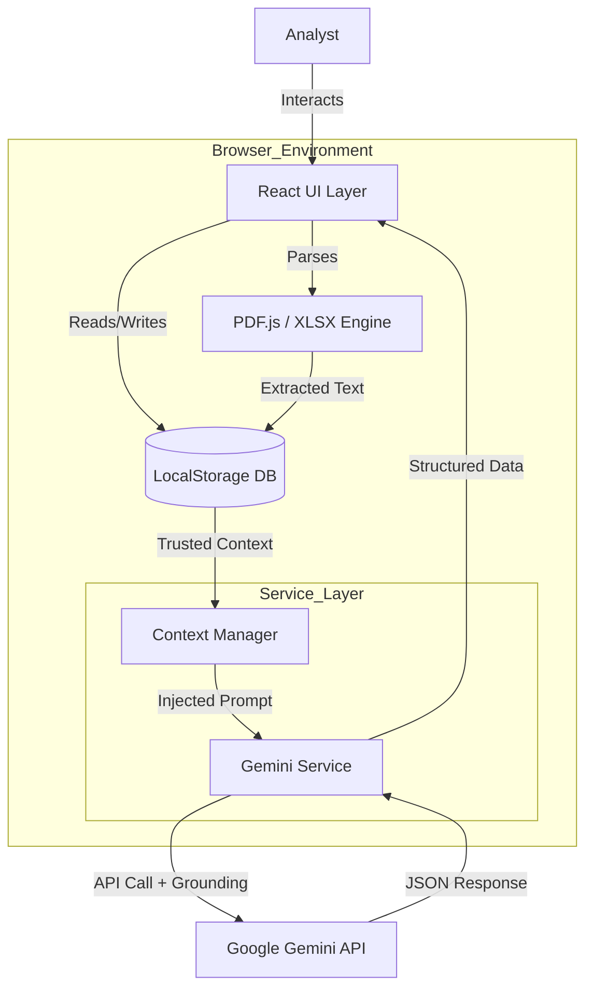

# HivePro Threat Intel AI


## 1. Overview
**HivePro Threat Intel AI** is a next-generation **Threat Intelligence Platform (TIP)** designed for forensic cybersecurity analysis. Unlike traditional platforms that rely on static databases, this application utilizes **Google Gemini 3 Flash** as a real-time reasoning engine to generate live, up-to-the-minute threat profiles.

It features a **Client-Side RAG (Retrieval-Augmented Generation)** architecture, allowing analysts to upload private PDF/CSV reports. The application extracts this intelligence locally and "injects" it into the AI's context window, enabling the model to answer questions based on internal, trusted data without needing a backend vector database.

---

## 2. Key Features

*   **🕵️‍♂️ AI-Driven Profiling**: Generates exhaustive profiles for Threat Actors (APTs), including Origins, TTPs, Campaigns, and Target Sectors.
*   **🧠 Client-Side RAG**: Upload trusted PDFs or CSVs. The app parses them in the browser and forces the AI to use them as the "Source of Truth".
*   **⚡ Granular Refresh**: Update specific sections of a profile (e.g., just "Aliases" or "CVEs") to ensure accuracy without regenerating the whole report.
*   **📰 Live Grounding**: Fetches confirmed breaches and exploits from the last 7 days using Google Search Grounding.
*   **🛡️ Strict Validation**: Enforces strict separation between Actor Identities, Tools, and Parent Organizations using advanced prompt engineering.
*   **📊 Excel Export**: Download comprehensive threat reports for offline analysis.

---

## 3. Architecture

The system is built as a **Serverless Single Page Application (SPA)**. It has **no backend server**. All logic, persistence, and AI communication happen directly in the user's browser.

### High-Level Diagram



### Tech Stack
*   **Frontend**: React 19 (TypeScript)
*   **Styling**: Tailwind CSS (Dark/Cyber Aesthetic)
*   **AI Model**: Google Gemini 3 Flash / 2.5 (via `@google/genai`)
*   **Persistence**: Browser LocalStorage
*   **File Processing**: `pdfjs-dist` (PDFs), `xlsx` (Spreadsheets)

---

## 4. Workflows

### A. Threat Profiling (Generation)
1.  **Input**: User enters an Actor name (e.g., "Volt Typhoon").
2.  **Lookup**: App checks `LocalStorage` for any "Trusted Files" or "Approved URLs" associated with this name.
3.  **Prompt Engineering**:
    *   The system constructs a prompt enforcing a JSON Schema.
    *   If trusted files exist, their raw text (up to 1M tokens) is injected into the prompt with the instruction: *"Treat this data as absolute fact."*
4.  **Execution**: Gemini searches Google for verification links and fills the schema.
5.  **Validation**: The AI output is cross-referenced with hardcoded "Critical Data" (if any) to ensure specific CVEs are never missed.

### B. Granular Refresh
1.  **Action**: User clicks "Refresh Aliases".
2.  **Targeted Prompt**: The app sends a specific prompt: *"List ALL aliases for [Actor]. Exclude Tools and Malware."*
3.  **Merge**: The returned array is merged into the existing React state, preserving the rest of the profile.

### C. Intel Chat (Context-Aware)
1.  **Message**: User asks *"What CVEs did they use?"*
2.  **Scan**: The chat service scans the message for known Actor names.
3.  **Injection**: If "APT29" is mentioned and a PDF report for APT29 exists in `LocalStorage`, the PDF content is silently attached to the message sent to Gemini.
4.  **Answer**: Gemini answers using the PDF content, citing it as the source.

---

## 5. Advantages of this Architecture

1.  **Zero Infrastructure Cost**: No backend servers, databases, or vector stores to maintain.
2.  **Data Privacy**:
    *   Uploaded files are **never** stored on an external server. They live in the user's browser `LocalStorage`.
    *   Files are only sent to the AI model ephemeral context window during a request.
3.  **Low Latency**: Direct communication between the browser and Google's edge API.
4.  **Deterministic Outputs**: Uses `temperature: 0` and strictly typed JSON Schemas to prevent hallucinations and ensure data structure consistency.

---

## 6. Directory Structure

```
/
├── components/
│   ├── ThreatActor/       # Main CRUD Panel & Reports
│   ├── Chat/              # Context-Aware Chat Interface
│   ├── LiveFeed/          # Real-time News Aggregator
│   ├── TrustedSources/    # File Upload & URL Management
│   └── Sidebar.tsx        # Navigation
├── services/
│   └── geminiService.ts   # AI Logic, Prompt Engineering, API Calls
├── types.ts               # TypeScript Interfaces (ThreatActor, CVE, etc.)
├── constants.ts           # Hardcoded Fallback Data / Validation Lists
└── App.tsx                # Main Layout Controller
```

---

## 7. How to Run

1.  Clone the repository.
2.  Install dependencies (React, Lucide, Gemini SDK).
3.  Set your `API_KEY` in the environment variables.
4.  Run `npm start` or use the provided index.html in a strictly ESM-compatible environment (like Vite).
