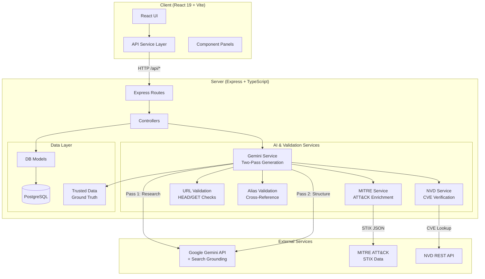

<p align="center">
  
  
  
  
</p>

<h1 align="center">HivePro Threat Intel AI</h1>

<p align="center">
  <strong>AI-Powered Threat Intelligence Platform with Real-Time Profiling, MITRE ATT&CK Enrichment, and Multi-Source Validation</strong>
</p>

<p align="center">
  <em>Generate verified threat actor profiles in seconds, not hours. Powered by Google Gemini with Google Search grounding, post-generation validation pipelines, and client-side RAG for private intelligence.</em>
</p>

---

## Overview

**HivePro Threat Intel AI** is a full-stack Threat Intelligence Platform (TIP) that leverages **Google Gemini 3 Flash** as a real-time reasoning engine to generate comprehensive, validated threat actor profiles. The platform goes beyond simple AI generation by implementing a rigorous **post-generation validation pipeline** that cross-references output against MITRE ATT&CK, NVD, trusted ground-truth data, and user-supplied intelligence.

Unlike traditional threat intel platforms that rely on static databases, this system produces live, up-to-the-minute profiles with verified CVEs, validated aliases, and confirmed intelligence sources.

### Why This Exists

Manual threat actor research takes **4-7 hours** per profile. Analysts must cross-reference MITRE ATT&CK, NVD, vendor blogs, CISA advisories, and internal reports. This platform reduces that to **30-45 seconds** while maintaining accuracy through automated validation.

---

## Key Features

| Feature | Description |
|---------|-------------|
| **AI-Driven Profiling** | Generates exhaustive threat actor profiles (origins, TTPs, campaigns, target sectors) using Gemini with Google Search grounding |
| **Two-Pass Architecture** | Pass 1: Research with web search grounding. Pass 2: Structured JSON extraction with schema enforcement |
| **Post-Generation Pipeline** | 4-step validation: Trusted data override, MITRE enrichment, URL validation, minimum source enforcement |
| **MITRE ATT&CK Enrichment** | Auto-fetches STIX data from MITRE, enriches aliases, first_seen dates, and ATT&CK page URLs |
| **NVD CVE Validation** | Cross-validates CVE severity ratings against the National Vulnerability Database |
| **Alias Cross-Validation** | Rejects aliases belonging to different actors, malware names, and qualified/ambiguous names |
| **Client-Side RAG** | Upload PDF/CSV/XLSX reports as trusted context. The AI treats uploaded data as ground truth |
| **Granular Section Refresh** | Update specific sections (Aliases, Description, CVEs) without regenerating the entire profile |
| **URL Validation** | HEAD/GET validation of all source URLs with a tiered whitelist (MITRE, CISA, NVD, vendor blogs) |
| **Generation Logging** | Transparent pipeline logs showing all sources visited, steps taken, and timing data |
| **Intel Chat** | Context-aware AI chat that incorporates uploaded documents and actor profiles |
| **Live Cyber News Feed** | Real-time aggregation of cybersecurity news via Google Search grounding |
| **Excel Export** | One-click `.xlsx` export of complete threat actor reports |
| **Trusted Source Management** | Per-actor URL and file management for approved intelligence sources |

---

## Performance Benchmark

| Task | Manual Analysis | HivePro AI | Improvement |
|------|----------------|------------|-------------|
| **Alias Discovery** | 30-45 min | < 5 sec | ~99% faster |
| **CVE Mapping** | 2-4 hours | 10-15 sec | ~99% faster |
| **TTP & Campaign Analysis** | 1-2 hours | 5-10 sec | ~99% faster |
| **Report Generation** | 30 min | Instant | 100% automated |
| **Total** | ~4-7 hours | ~30-45 sec | **~99% reduction** |

---

## Architecture

### High-Level System Diagram



### AI Generation Pipeline


### Monorepo Structure

```
AI-Threat-Actor-Tracking-system/
├── client/                          # React 19 SPA (Vite + TypeScript + Tailwind)
│   ├── src/
│   │   ├── components/
│   │   │   ├── ThreatActor/
│   │   │   │   ├── ThreatActorPanel.tsx    # Main profile CRUD panel
│   │   │   │   └── GenerationLogPanel.tsx  # Pipeline transparency logs
│   │   │   ├── Chat/
│   │   │   │   └── ChatPanel.tsx           # Context-aware AI chat
│   │   │   ├── LiveFeed/
│   │   │   │   └── LiveFeedPanel.tsx       # Real-time cyber news
│   │   │   ├── TrustedSources/
│   │   │   │   └── TrustedSourcesPanel.tsx # Source management UI
│   │   │   └── Sidebar.tsx                 # Navigation sidebar
│   │   ├── services/
│   │   │   └── apiService.ts               # HTTP client for all /api endpoints
│   │   ├── types.ts                        # Re-exports shared types
│   │   └── App.tsx                         # Root layout + view switching
│   └── vite.config.ts                      # Dev server, proxy, path aliases
│
├── server/                          # Express API (TypeScript + ESM)
│   ├── src/
│   │   ├── config/
│   │   │   └── database.ts                 # PostgreSQL pool, schema, seeding
│   │   ├── controllers/
│   │   │   ├── actorController.ts          # Profile generation, CRUD
│   │   │   ├── chatController.ts           # AI chat handler
│   │   │   ├── newsController.ts           # Live news handler
│   │   │   └── sourceController.ts         # Trusted source management
│   │   ├── data/
│   │   │   └── trustedData.ts              # Ground-truth overrides (APT29, etc.)
│   │   ├── middleware/
│   │   │   └── errorHandler.ts             # Global error handler
│   │   ├── models/
│   │   │   └── db.ts                       # All PostgreSQL queries
│   │   ├── routes/
│   │   │   ├── actors.ts                   # /api/actors routes
│   │   │   ├── chat.ts                     # /api/chat routes
│   │   │   ├── news.ts                     # /api/news routes
│   │   │   └── sources.ts                  # /api/sources routes
│   │   ├── services/
│   │   │   ├── geminiService.ts            # Core AI pipeline (two-pass + validation)
│   │   │   ├── mitreService.ts             # MITRE ATT&CK STIX integration
│   │   │   ├── aliasValidationService.ts   # Cross-validates aliases against MITRE
│   │   │   ├── urlValidation.ts            # URL HEAD/GET validation + whitelist
│   │   │   └── nvdService.ts               # NVD CVE severity verification
│   │   ├── tests/
│   │   │   └── validateProfiles.ts         # Automated profile accuracy tests
│   │   ├── env.ts                          # Loads .env from project root
│   │   └── index.ts                        # Express entry point
│   └── uploads/                            # Multer file upload destination
│
├── shared/                          # Shared TypeScript types
│   └── types.ts                            # ThreatActor, CVE, GenerationLog, etc.
│
├── .env.example                     # Environment variable template
├── CLAUDE.md                        # Claude Code project instructions
└── package.json                     # Root orchestration scripts
```

---

## Tech Stack

| Layer | Technology | Purpose |
|-------|-----------|---------|
| **Frontend** | React 19, TypeScript, Tailwind CSS | Responsive dark-themed UI |
| **Build Tool** | Vite 6 | Fast HMR, API proxy, production builds |
| **Backend** | Express 4, TypeScript, ESM | REST API with structured error handling |
| **Database** | PostgreSQL (via `pg`) | Persistent storage for actors, CVEs, sources, chat |
| **AI Engine** | Google Gemini 3 Flash (`@google/genai`) | Two-pass profile generation with search grounding |
| **MITRE Integration** | MITRE ATT&CK STIX 2.1 | Alias enrichment, first_seen dates, ATT&CK URLs |
| **File Processing** | `pdfjs-dist`, `xlsx` | Server-side PDF/CSV/XLSX parsing for trusted files |
| **File Upload** | Multer | Multipart form handling (20MB limit) |
| **Security** | Helmet, CORS | HTTP security headers, origin restriction |
| **Icons** | Lucide React | Consistent icon system |
| **Export** | SheetJS (xlsx) | Client-side Excel report generation |

---

## Getting Started

### Prerequisites

- **Node.js** 18+
- **PostgreSQL** 14+ running locally
- **Google Gemini API Key** ([Get one here](https://aistudio.google.com/apikey))

### 1. Clone the Repository

```bash
git clone https://github.com/Nezeon/AI-Threat-Actor-Tracking-system.git
cd AI-Threat-Actor-Tracking-system
```

### 2. Create the Database

```sql
-- Connect to PostgreSQL and create the database
CREATE DATABASE threatintel;
```

> Tables are auto-created on first server startup. No migrations needed.

### 3. Configure Environment

```bash
cp .env.example .env
```

Edit `.env` with your values:

```env
GEMINI_API_KEY=your_gemini_api_key_here
DATABASE_URL=postgresql://localhost:5432/threatintel
PORT=3001
CLIENT_ORIGIN=http://localhost:3000
```

### 4. Install Dependencies

```bash
npm run setup
```

This installs dependencies for root, client, and server packages.

### 5. Start Development

```bash
npm run dev
```

This concurrently starts:
- **Client**: Vite dev server on `http://localhost:3000`
- **Server**: Express API on `http://localhost:3001` (with hot reload via tsx)

The Vite dev server automatically proxies `/api/*` requests to the Express server.

---

## Available Scripts

| Command | Description |
|---------|-------------|
| `npm run setup` | Install all dependencies (root + client + server) |
| `npm run dev` | Start both client and server in dev mode |
| `npm run dev:client` | Start only the Vite client (port 3000) |
| `npm run dev:server` | Start only the Express server with hot reload (port 3001) |
| `npm run build` | Build the client for production |
| `npm start` | Start the production server (serves client build) |

---

## Database Schema

The server auto-creates six tables on startup:

| Table | Purpose |
|-------|---------|
| `threat_actors` | Core actor profiles (name, aliases, descriptions, timestamps) |
| `actor_cves` | CVEs linked to actors (severity, verification references) |
| `actor_sources` | Intelligence sources linked to actor profiles |
| `trusted_urls` | User-approved URLs per actor for RAG context |
| `trusted_files` | Uploaded PDF/CSV files per actor (parsed content stored) |
| `chat_messages` | Persistent chat history with context |

---

## API Endpoints

### Threat Actors

| Method | Endpoint | Description |
|--------|----------|-------------|
| `GET` | `/api/actors` | List all actors |
| `GET` | `/api/actors/:id` | Get actor by ID |
| `POST` | `/api/actors/generate` | Generate new profile via AI |
| `POST` | `/api/actors/:id/refresh-section` | Refresh a specific section |
| `PUT` | `/api/actors/:id` | Update actor |
| `DELETE` | `/api/actors/:id` | Delete actor |

### Chat

| Method | Endpoint | Description |
|--------|----------|-------------|
| `POST` | `/api/chat` | Send message to AI with optional context |

### News

| Method | Endpoint | Description |
|--------|----------|-------------|
| `GET` | `/api/news` | Fetch live cybersecurity news |

### Trusted Sources

| Method | Endpoint | Description |
|--------|----------|-------------|
| `GET` | `/api/sources` | List all actor names with trusted sources |
| `GET` | `/api/sources/:actorName` | Get URLs and files for an actor |
| `POST` | `/api/sources/urls` | Add approved URL |
| `DELETE` | `/api/sources/urls/:id` | Remove approved URL |
| `POST` | `/api/sources/files` | Upload trusted file (PDF/CSV/XLSX) |
| `DELETE` | `/api/sources/files/:id` | Remove trusted file |

### Health

| Method | Endpoint | Description |
|--------|----------|-------------|
| `GET` | `/api/health` | Server health check |

---

## How It Works

### 1. Profile Generation

When an analyst requests a threat actor profile:

1. **Pre-Lookup**: The system queries MITRE ATT&CK STIX data for known information about the actor
2. **Trusted Context Assembly**: Any user-uploaded files and approved URLs for this actor are fetched from PostgreSQL
3. **Pass 1 (Research)**: Gemini performs web research with Google Search grounding, producing a comprehensive text analysis
4. **Pass 2 (Structuring)**: A second Gemini call extracts the research into a strictly-typed JSON schema
5. **Post-Generation Pipeline**:
   - **Step 1 - Trusted Data Override**: Ground-truth data (from `trustedData.ts`) overrides AI output for known actors
   - **Step 2 - MITRE Enrichment**: Aliases, first_seen, and ATT&CK URL are merged from MITRE
   - **Step 2.5 - NVD Validation**: CVE severity ratings are cross-checked against NVD
   - **Step 3 - URL Validation**: All source URLs are tested via HEAD requests; ephemeral/dead links are removed
   - **Step 4 - Source Enforcement**: Ensures minimum viable source count
6. **Persistence**: The validated profile is saved to PostgreSQL
7. **Generation Log**: A detailed log of all steps, sources, and timing is returned for analyst transparency

### 2. Trusted Data System

The platform maintains **ground-truth overrides** for critical threat actors (APT29, Volt Typhoon, APT41, etc.). This data:

- Overrides AI-generated CVEs with verified, referenced CVEs
- Corrects aliases using confirmed cross-vendor mappings
- Provides verified first_seen dates
- Includes curated intelligence source URLs

This ensures that even when the AI hallucinates, the final output for well-known actors remains accurate.

### 3. Alias Validation

Aliases undergo three-tier validation:

1. **Format Check**: Rejects aliases with qualifiers like "(overlap)" or "(related)"
2. **Type Check**: Rejects names that MITRE classifies as malware or tools
3. **Attribution Check**: Rejects aliases that MITRE attributes to a different threat actor

### 4. URL Validation Tiers

| Tier | Examples | Treatment |
|------|----------|-----------|
| **Tier 0** | MITRE, Malpedia, CISA, NVD | Always trusted |
| **Tier 1** | CrowdStrike, Mandiant, Kaspersky, Talos | High confidence |
| **Tier 2** | BleepingComputer, DarkReading, SecurityWeek | Verified journalism |
| **Tier 3** | Secureworks, Volexity, FireEye | Additional CTI |
| **Ephemeral** | Vertex AI Search, Google Cache | Always rejected |

---

## Workflows

### Threat Actor Profiling

```
Analyst enters "APT29" → Pre-MITRE lookup → Two-pass Gemini generation →
4-step validation pipeline → Validated profile displayed → Excel export available
```

### Granular Section Refresh

```
Analyst clicks "Refresh Aliases" → Targeted Gemini prompt →
New aliases merged with existing → MITRE cross-validation applied
```

### Intel Chat

```
Analyst asks "What CVEs did Volt Typhoon exploit?" →
System injects actor profile + uploaded docs as context →
Gemini answers with citations from trusted sources
```

### Source Management

```
Analyst uploads vendor PDF for APT41 → Server parses PDF content →
Content stored in PostgreSQL → Next generation uses PDF as ground truth
```

---

## Environment Variables

| Variable | Required | Default | Description |
|----------|----------|---------|-------------|
| `GEMINI_API_KEY` | Yes | — | Google Gemini API key |
| `DATABASE_URL` | Yes | `postgresql://localhost:5432/threatintel` | PostgreSQL connection string |
| `PORT` | No | `3001` | Server port |
| `CLIENT_ORIGIN` | No | `http://localhost:3000` | CORS allowed origin |
| `NODE_ENV` | No | `development` | Environment mode |

---

## Production Deployment

### Build

```bash
npm run build          # Builds client to client/dist/
cd server && npm run build  # Compiles server TypeScript to server/dist/
```

### Run

```bash
NODE_ENV=production npm start
```

In production mode, the Express server serves the client build as static files and handles all API routes.

### Recommended Free Hosting Stack

| Service | Use | Free Tier |
|---------|-----|-----------|
| [Render](https://render.com) | Backend (Express) | 750 hrs/month Web Service |
| [Render Static](https://render.com) | Frontend (React build) | Unlimited static sites |
| [Neon](https://neon.tech) | PostgreSQL | 0.5 GB storage, always free |

---

## Contributing

1. Fork the repository
2. Create a feature branch (`git checkout -b feature/amazing-feature`)
3. Commit your changes (`git commit -m 'Add amazing feature'`)
4. Push to the branch (`git push origin feature/amazing-feature`)
5. Open a Pull Request

---

## License

This project is open source and available under the [MIT License](LICENSE).

---

<p align="center">
  <strong>Built for Threat Intelligence Analysts</strong><br/>
  <em>Reducing research time from hours to seconds with AI-powered validation</em>
</p>
